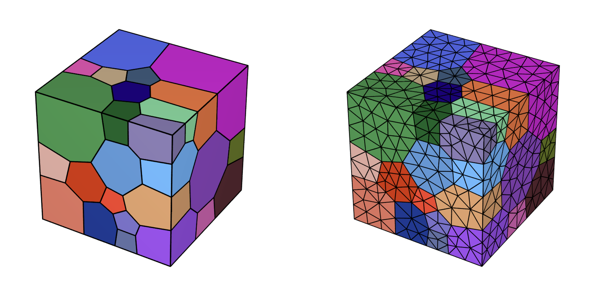
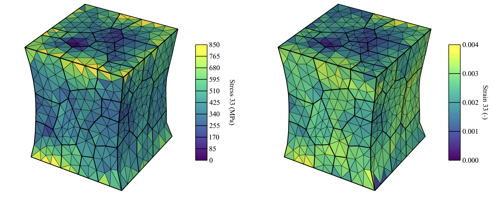
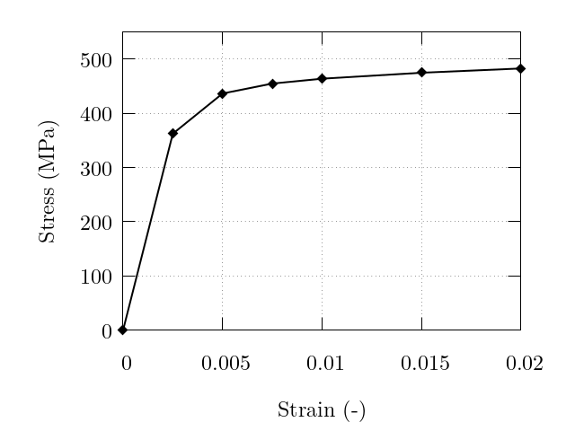
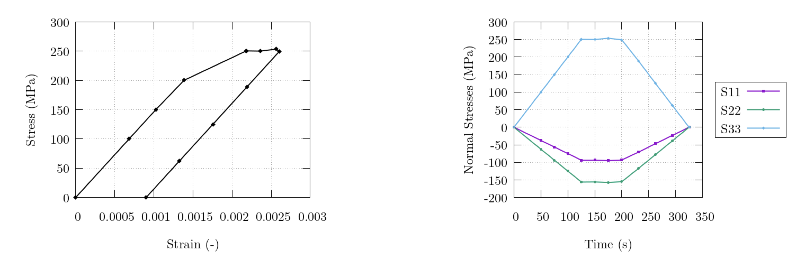
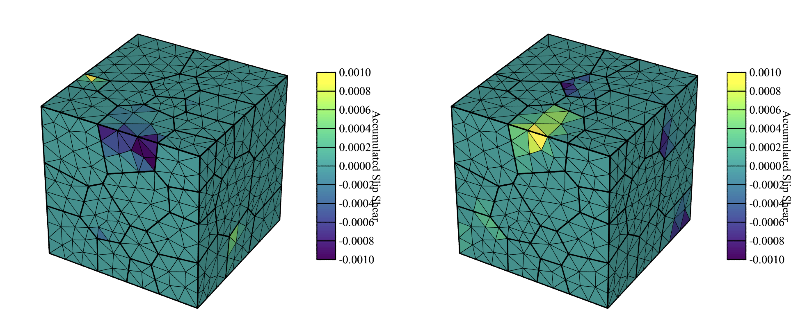
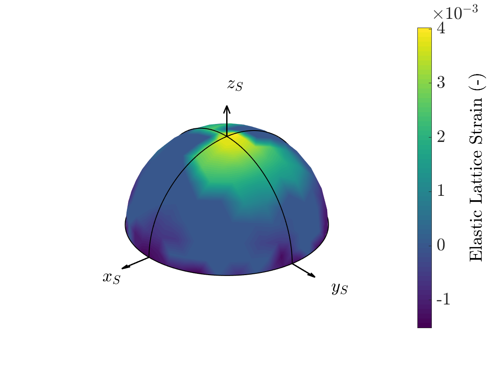

.. _example_simulations:

Example Simulations
===================

Several example simulations come pre-packaged to get you started with running simulations. These examples are reference cases to show how a simulation should be built and how FEPX can interface with Neper in order to prepare mesh files as well as post-process a simulation directory. All examples contain the necessary configuration (:file:`simulation.config`) and mesh (:file:`simulation.msh`) files, along with a shell script to generate the mesh file directly from Neper. In order to run the provided shell scripts, you must have a configured installation of Neper present on your system. In the following, visualizations of the undeformed and deformed mesh are generated with Neper while graphs are generated with Gnuplot.

All examples can be run either in serial or parallel (:ref:`Running a Simulation <running_a_simulation>`), but the included scripts are pre-set to run in parallel on 4 cores, and parallel execution with OpenMPI via :data:`mpirun` is assumed.

A polycrystal containing 50 grains is generated via Voronoi tessellation for all examples. Each cell in the tessellation represents a discrete grain in the domain and all grains are volumetrically discretized into finite elements. Visualizations of the tessellated domain (morphology) and the associated finite element mesh are shown below. Length units are assumed to be [mm], thus, all pressure units assumed to be [MPa] for the simulation (including input parameters).

    50 grain polycrystal used in all examples, colored by grain id, and (right) its finite element mesh.

.. _uniaxial_ex:

Uniaxial Control (:file:`examples/1_uniaxial`)
----------------------------------------------

This example covers the uniaxial tensile deformation of an FCC polycrystal by strain targeting to 2% axial strain.  Material parameters are of a generic a copper alloy, and are provided in the below tables. Two steps are defined with a variable number of increments for each step. Grip boundary conditions are applied to the sample with the primary loading face set as :data:`z1` loaded in the :data:`+z` direction. Elemental stress and elastic strain tensors are output, along with the nodal coordinates and surface-integrated forces. Illustrations of the stress and elastic strain fields, as well as the macroscopic stress-strain curve are shown below.

.. list-table:: Single crystal elastic constants.
    :widths: 25 25 25 25 25
    :align: center
    :header-rows: 1

    * - Phase
      - Type
      - :math:`C_{11}` [MPa]
      - :math:`C_{12}` [MPa]
      - :math:`C_{44}` [MPa]
    * - :math:`\alpha`
      - FCC
      - :math:`245.0 \times 10^3`
      - :math:`155.0 \times 10^3`
      - :math:`62.5 \times 10^3`

.. list-table:: Initial slip system strenghts and other plasticity parameters.
    :widths: 10 10 10 10 10 10 10
    :align: center
    :header-rows: 1

    * - Phase
      - :math:`m` [-]
      - :math:`\dot{\gamma_0}` [1/s]
      - :math:`h_0` [MPa]
      - :math:`g_0` [MPa]
      - :math:`g_{s0}` [MPa]
      - :math:`n` [-]
    * - :math:`\alpha`
      - 0.05
      - 1.0
      - 200.0
      - 210.0
      - 330,0
      - 1.0

    Deformed sample at 2% axial strain (deformation field is exaggerated 10x for illustrative purposes), colored by (left) stress (:math:`\sigma_{33}`), and (right) elastic strain (:math:`\epsilon_{33}`).

    Macroscopic stress-strain curve recovered from the surface-integrated forces in :file:`post.force.z1`. Markers denote values output at each increment.

Multiaxial Control with Constant Strain Rate (:file:`examples/2_triaxCSR`)
--------------------------------------------------------------------------

This example covers the biaxial deformation of an HCP polycrystal at a constant strain rate. Loads are applied normal to the surface, maintaining proportional macroscopic load ratios of :math:`-1`::math:`0`::math:`1` for the :math:`x`::math:`y`::math:`z` directions, respectively. Load tolerance options are prescribed and latent hardening is enabled, as well as saturation strength evolution. The primary loading direction is set to be in the :math:`x` direction, and the strain rate is doubled on the second step. Elemental values for the equivalent plastic strain and plastic work are output, along with the nodal coordinates and surface-integrated forces. Material parameters are those for the :math:`\alpha` phase of Ti-6Al-4V and are provided in the below tables. The latent parameters are input values to the hardening interaction matrix [CARSON17]_. Illustrations of the results are provided in the below figures.

.. list-table:: Single crystal elastic constants.
    :widths: 25 25 25 25 25 25
    :align: center
    :header-rows: 1

    * - Phase
      - Type
      - :math:`C_{11}` [MPa]
      - :math:`C_{12}` [MPa]
      - :math:`C_{13}` [MPa]
      - :math:`C_{44}` [MPa]
    * - :math:`\alpha`
      - HCP
      - :math:`169.66 \times 10^3`
      - :math:`88.66 \times 10^3`
      - :math:`61.66 \times 10^3`
      - :math:`42.50 \times 10^3`

.. list-table:: Plasticity parameters.
    :widths: 10 10 10 10 10 10 10 10 10
    :align: center
    :header-rows: 1

    * - Phase
      - :math:`m` [-]
      - :math:`\dot{\gamma_{0}}` [1/s]
      - :math:`h_{0}` [MPa]
      - :math:`g_{s0}` [MPa]
      - :math:`m^\prime` [-]
      - :math:`\dot{\gamma_{s}}` [1/s]
      - :math:`n` [-]
      - :math:`c/a` [-]
    * - :math:`\alpha`
      - 0.01
      - 1.0
      - 190.0
      - 530.0
      - 1.1
      - 1.0
      - 1.0
      - 1.587

.. list-table:: Initial slip system strengths and hardening parameters.
    :widths: 10 10 10 10 10 10
    :align: center
    :header-rows: 1

    * - Phase
      - :math:`g_0` (basal) [MPa]
      - :math:`g_0` (prismatic) [MPa]
      - :math:`g_0` (pyramidal) [MPa]
      - :math:`h_{diag}` [-]
      - :math:`h_{1}-h_{7}` [-]
    * - :math:`\alpha`
      - 390.0
      - 468.0
      - 663.0
      - 1.0
      - 1.4

.. figure :: images/2_all.png
    :width: 75%
    :align: center

    Deformed sample at the end of the second load step (deformation field is exaggerated 10x for illustrative purposes), colored by (left) plastic work (:math:`W^{p}`) and (right) equivalent plastic strain (:math:`\bar\epsilon^{P}`). Note that, unlike the deformed sample in :ref:`uniaxial_ex`, a multiaxial simulation will maintain the orthogonal, planar surfaces throughout the simulation.

.. figure :: images/2_normalstraintime.png
    :width: 70%
    :align: center

    Evolution of the macroscopic normal strains. Note the strain rate increase corresponding to the strain-rate jump defined for step 2.

.. _triaxial_clr_ex:

Multiaxial Control with Constant Load Rate (:file:`examples/3_triaxCLR`)
------------------------------------------------------------------------

This example covers the triaxial deformation of a dual phase FCC/BCC polycrystal (phase map shown below) at a constant load rate followed by a dwell episode and subsequent unloading. Loads are applied normal to the surface, maintaining proportional macroscopic load ratios of :math:`-0.375`::math:`-0.625`::math:`1` for the :math:`x`::math:`y`::math:`z` directions, respectively. Load tolerance options are prescribed. The primary loading direction is set to be in the :math:`z` direction, and a dwell episode is initiated on the second step. Elemental critical resolved shear stresses and equivalent strains are output, along with the nodal coordinates and surface-integrated forces. Material parameters are those for the austenitic (:math:`\gamma`) and ferritic (:math:`\alpha`) phases of an LDX-2101 steel, and are provided in the tables below. Illustrations of the results are provided in the figures below.

.. list-table:: Single crystal elastic constants.
    :widths: 25 25 25 25 25
    :align: center
    :header-rows: 1

    * - Phase
      - Type
      - :math:`C_{11}` [MPa]
      - :math:`C_{12}` [MPa]
      - :math:`C_{44}` [MPa]
    * - :math:`\gamma`
      - FCC
      - :math:`204.6 \times 10^3`
      - :math:`137.7 \times 10^3`
      - :math:`126.2 \times 10^3`
    * - :math:`\alpha`
      - BCC
      - :math:`236.9 \times 10^3`
      - :math:`140.6 \times 10^3`
      - :math:`116.0 \times 10^3`

.. list-table:: Initial slip system strengths and other plasticity parameters.
    :widths: 10 10 10 10 10 10 10
    :align: center
    :header-rows: 1

    * - Phase
      - :math:`m` [-]
      - :math:`\dot{\gamma_{0}}` [1/s]
      - :math:`h_{0}` [MPa]
      - :math:`g_{0}` [MPa]
      - :math:`g_{s0}` [MPa]
      - :math:`n` [-]
    * - :math:`\gamma,\alpha`
      - 0.02
      - 1.0
      - 391.9
      - 200.0
      - 335.0
      - 1.0

.. figure:: images/3_all.png
    :width: 75%
    :align: center

    (left) Grain and phase assignment distribution in the virtual sample. Red-colored grains are :math:`\gamma`-phase and green-colored grains are :math:`\alpha`-phase. (right) Elastically unloaded sample colored by critical resolved shear stress.

    (left) Evolution of the macroscopic normal strains, and (right) evolution of the macroscopic stress and strain on the :math:`z` surface. Note that the load rate in the :math:`z` direction is always held constant during the simulation (except during the dwell episode) while the other two are automatically modified to maintain load proportionality throughout the simulation.

Restarting a Simulation with Appended Load Steps (:file:`examples/4_restart`)
-----------------------------------------------------------------------------

An example use case for the restart capabilities are to append additional loading steps to a completed simulation. This example covers the cyclic triaxial deformation of an FCC polycrystal at a constant strain rate. Each restart simulation adds an addition load-unload cycle. Loads are applied normal to the surface, maintaining proportional macroscopic load ratios of :math:`0`::math:`0`::math:`1` for the :math:`x`::math:`y`::math:`z` directions, respectively. Load tolerance options are prescribed and cyclic hardening is activated. The primary loading direction is set to be in the :math:`z` direction. Elemental equivalent plastic deformation rate, slip system shears, slip system shear rates, nodal coordinates, and restart files are output. Restart files are only printed on the first cycle. Material parameters are those for a AL6XN steel and are provided in the tables below. Illustrations of the results are provided in the figures below.

The included shell script will run the initial simulation in :file:`examples/4_restart/cycle1` which runs 2 load steps (a single load-unload cycle) and prints the files necessary to restart the simulation from the final state (using print option :data:`print restart`). After successful completion of the first cycle, the mesh file and restart files are copied into the secondary directory (:file:`examples/4_restart/cycle2`) and the simulation is performed again for another 2 load steps (a second load-unload cycle). The configuration file for the second cycle (:file:`simulation_cycle2.config`) contains the following input to allow for simulating additional load steps to those already completed:

::

    restart on

along with the additional load steps (as described in the :ref:`Deformation History <deformation_history>` section). The restarted simulation will continue with the load steps as defined in :file:`simulation_cycle2.config`. Restart control information will print to the console upon the execution of the second cycle to briefly assess the state of the sample when the simulation is restarted. Material parameters are defined as:

.. list-table:: Single crystal elastic constants.
    :widths: 25 25 25 25 25
    :align: center
    :header-rows: 1

    * - Phase
      - Type
      - :math:`C_{11}` [MPa]
      - :math:`C_{12}` [MPa]
      - :math:`C_{44}` [MPa]
    * - :math:`\gamma`
      - FCC
      - :math:`204.6 \times 10^3`
      - :math:`137.7 \times 10^3`
      - :math:`126.2 \times 10^3`

.. list-table:: Initial slip system strengths and other plasticity parameters.
    :widths: 10 10 10 10 10 10 10
    :align: center
    :header-rows: 1

    * - Phase
      - :math:`m` [-]
      - :math:`\dot{\gamma_{0}}` [1/s]
      - :math:`h_{0}` [MPa]
      - :math:`g_{0}` [MPa]
      - :math:`g_{s0}` [MPa]
      - :math:`n` [-]
    * - :math:`\alpha`
      - 0.02
      - 1.0
      - 375.0
      - 160.0
      - 1000.0
      - 1.0

.. list-table:: Cyclic hardening parameters.
    :widths: 25 25 25
    :align: center
    :header-rows: 1

    * - Phase
      - :math:`a` [-]
      - :math:`c` [-]
    * - :math:`\alpha`
      - 0.05
      - 3.50

    Sample after the second cycle is completed, (left) colored by accumulated slip shear on the :math:`(1 \bar 1 1)[0 1 1]` system and (right) colored by accumulated slip shear on the :math:`(1 \bar 1 1)[1 0 \bar 1]` system.

Running a Simulation with External Definition Files (:file:`examples/5_external`)
---------------------------------------------------------------------------------

Certain simulation input may be supplied from external files in order to allow for a static configuration and mesh file to be used for multiple simulations while certain microstructure information is varied. This example covers the uniaxial loading and unloading (via load targeting) of a dual phase FCC/BCC polycrystal including in-grain orientation distributions. Two steps are defined with a standard time-step value of 0.1s and a minimum time-step value of 0.01s. Minimal boundary conditions are applied to the sample with the primary loading face set as :data:`x1` loaded in the :data:`+x` direction. Elemental orientations and grain/phase assignments are supplied from the external files :file:`simulation.ori` and :file:`simulation.phase`, respectively. Elemental equivalent deformation rate, work, orientations, surface-integrated forces, and nodal coordinates are output. Fiber-averaging processing is performed via Neper. Material parameters are those for the austenitic (:math:`\gamma`) and ferritic (:math:`\alpha`) phases of a LDX-2101 steel and were previously provided in :ref:`triaxial_clr_ex`. Illustrations of the results are provided below.

Phases are assigned to grains in :file:`simulation.phase` based on grain ID, resulting in a 50%/50% phase distribution, by:

::

    $Groups
    elset
    50
    1 1
    2 1
    ...
    26 2
    ...
    50 2
    $EndGroups

Orientations are assigned to individual elements in the mesh by:

::

    $ElementOrientations
    5455 rodrigues:active
    1 -0.251740631650 -0.214936324918 0.002481866070
    2 -0.263893837934 -0.212836283407 0.021747296015
    ...
    5454 -0.062896691423 0.070800028157 0.312930553247
    5455 -0.055849086418 0.072826013322 0.294773397825
    $EndElementOrientations

Note that even though :data:`$ElsetOrientations` are also present in :file:`simulation.ori` as generated via Neper, the presence of :data:`$ElementOrientations` will always override any other orientations present in :file:`simulation.ori` or in the mesh file (:file:`simulation.msh`).

The definitions of the crystallographic fibers for the fiber averaging are defined in :file:`simulation.fib` by:

::

    1 1 1 -1.000000  0.000000  0.000000 1 5
    1 1 1 -0.993884 -0.110432  0.000000 1 5
    ...
    2 2 0  0.993884  0.110432  0.000000 1 5
    2 2 0  1.000000  0.000000  0.000000 1 5

Three unique fibers (hkl triplets) are defined in the file. The associated sample directions (uvw triplets) define unique points on a coarse mesh of a pole figure. The selection of sample directions in this manner allows for the fiber averaged output data to be visualized as a pole figure as seen below.

.. figure:: images/5_eltorientations.png
    :width: 40%
    :align: center

    Undeformed sample colored by orientation. Per-element orientations are assigned to the sample allowing for the prescription of initial misorientation within grains. Per-element orientations are generated from a 3-variate normal distribution with an average misorientation angle (with respect to a grain's average orientation) of 5 degrees.

.. figure:: images/5_all.png
    :width: 75%
    :align: center

    Deformed sample after the (left) first step and (right) second step are completed (deformation field is exaggerated 50x for illustrative purposes). The left figure is colored by equivalent deformation rate and the right figure is colored by work.

.. figure:: images/5_stresstime.png
    :width: 50%
    :align: center

    Evolution of the macroscopic normal stress. Note the increased point densities near to the load direction change exhibiting the simulation time-step value decreasing to accurately reach the load targets.

    A lattice strain pole figure depicting the fiber-averaged elastic lattice strain for the :math:`{200}` planes of the FCC phase (i.e., phase 1) at the end of step 1. Refinement of the pole figure would benefit from an increase in the number of grains in the simulated domain, as well as the inclusion of more unique fibers on the mesh of the pole figure.
