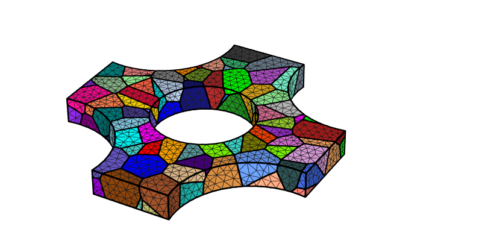
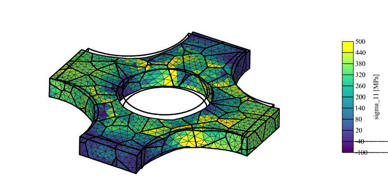
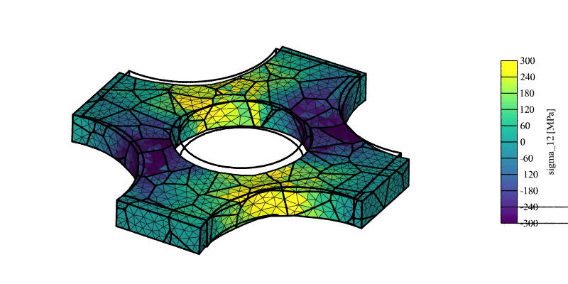
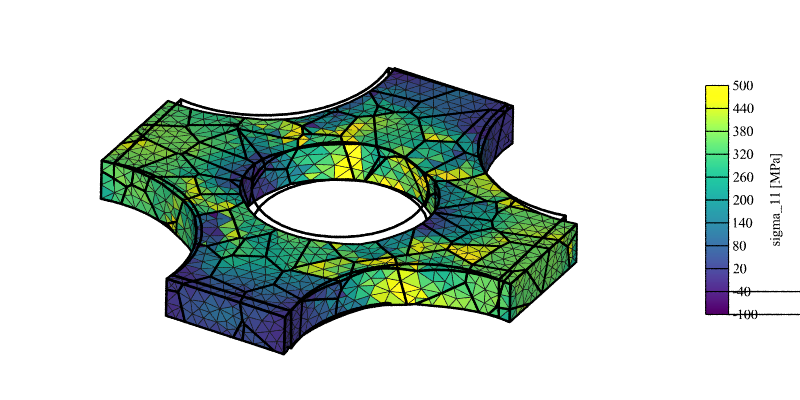
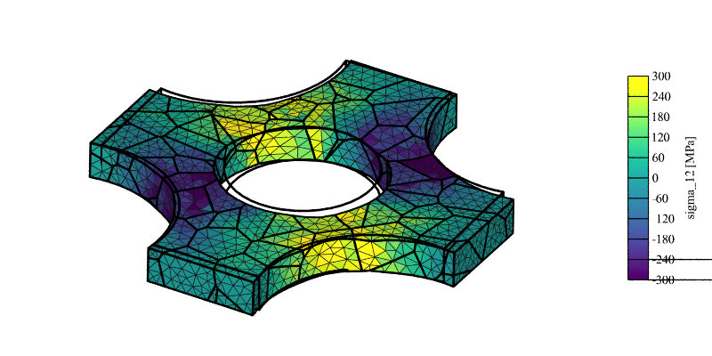
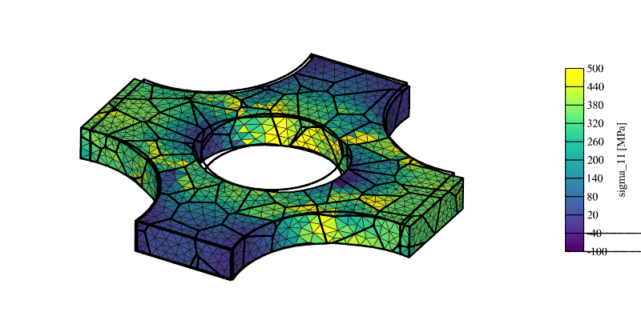
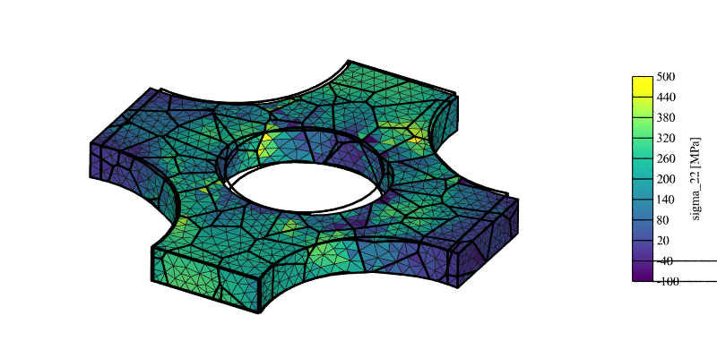
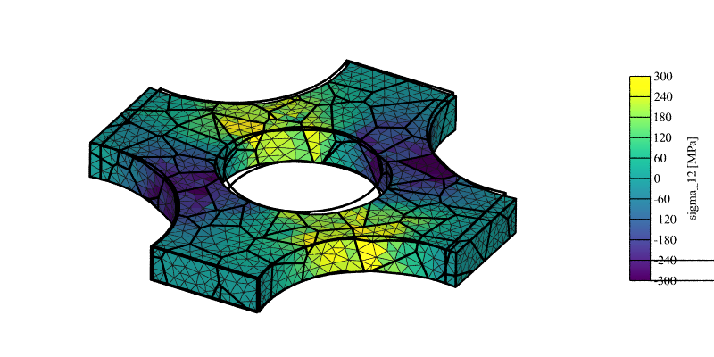

.. _cruciform_specimen_simulation:

Cruciform Specimen Simulation
=============================

.. note:: Read first: :ref:`simple_simulation`

The domain is a cruciform polycrystalline specimen for biaxial loadings, generated by Neper:

The specimen has (maximal) dimensions of 1, 1 and 0.1 along :math:`x`, :math:`y` and :math:`z`, respectively.

The same material behavior as in :ref:`simple_simulation` is used.

The specimen is subjected to biaxial loading, with different biaxiality rates applied via different sets of velocities along the two in-plane directions (:math:`x` and :math:`y`).  Choice is made to apply opposite velocities on the opposite surfaces, while the rigid-body motion along :math:`z` of a specific node is blocked.  The nodal coordinates, the elemental orientations, stresses and strains at final time (:math:`t = 5\text{ s}`) are written to file.

Equal Biaxial
-------------

The input is:

  - :download:`simulation.msh <cruciform_specimen_simulation/simulation.msh>` (16 partitions)
  - :download:`simulation.cfg <cruciform_specimen_simulation/simulation.cfg>`

    .. literalinclude:: cruciform_specimen_simulation/simulation.cfg

The results can be plotted using Neper:

  .. code-block:: console

    $ neper -V cruciform_specimen_simulation.sim -cameraprojection orthographic -cameralookat 0.6:0.6:z -showelt1d all -dataelt1drad 0.003 -dataelt3dedgerad 0.001 -dataelt3dedgecol 32:32:32 -cameraangle 18 -imagesize 800:400 -showelt3d none -showelt1d "domtype==1" -dataelt1dtrs 0.5 -imageformat pov:objects -print mesh -showelt3d all -showelt1d all -includepov mesh.pov -imageformat png -step 1 -datanodecoo coo -datanodecoofact 3 -dataeltscale -100:500 -dataeltscaletitle "sigma_11 [MPa]" -dataeltcol stress11 -print stress11 -dataeltscaletitle "sigma_22 [MPa]" -dataeltcol stress22 -print stress22 -dataeltscale -300:300 -dataeltscaletitle "sigma_12 [MPa]" -dataeltcol stress12 -print stress12
    $ for i in 11 22 12; do convert stress$i.png stress$i-scale3d.png -gravity East -composite cruciform_specimen_simulation/stress${i}_field.png; done

   :math:`\sigma_{11}` stress field (displacement field is exaggerated 3x for illustrative purposes).

.. figure:: cruciform_specimen_simulation/stress22_field_1p0.png
   :align: center

   :math:`\sigma_{22}` stress field (displacement field is exaggerated 3x for illustrative purposes).

   :math:`\sigma_{12}` stress field (displacement field is exaggerated 3x for illustrative purposes).

General Biaxial
---------------

The (strain) biaxiality rate can be modified by prescribing different velocities along :math:`x` and :math:`y`.
For velocities twice as small along :math:`y` as along :math:`x`, the input is:

    .. literalinclude:: cruciform_specimen_simulation/simulation.cfg-0p5
      :emphasize-lines: 27-28

The fields become:

   :math:`\sigma_{11}` stress field (displacement field is exaggerated 3x for illustrative purposes).

.. figure:: cruciform_specimen_simulation/stress22_field_0p5.png
   :align: center

   :math:`\sigma_{22}` stress field (displacement field is exaggerated 3x for illustrative purposes).

   :math:`\sigma_{12}` stress field (displacement field is exaggerated 3x for illustrative purposes).

For zero velocities along :math:`y` (and still the same velocities along :math:`x`), the input is:

    .. literalinclude:: cruciform_specimen_simulation/simulation.cfg-0p0
      :emphasize-lines: 27-28

The fields become:

   :math:`\sigma_{11}` stress field (displacement field is exaggerated 3x for illustrative purposes).

   :math:`\sigma_{22}` stress field (displacement field is exaggerated 3x for illustrative purposes).

   :math:`\sigma_{12}` stress field (displacement field is exaggerated 3x for illustrative purposes).

Note that a non-zero (average) :math:`\sigma_{22}` stress remains.  It could be relaxed by removing the velocity conditions along :math:`y` altogether, but greater consistency with the previous conditions can be obtained using :ref:`mpcs`, by making so that the :math:`y` faces remain in the same plane (hence, :math:`\sigma_{22} = 0` on average, while all nodes of the :math:`y` surfaces have the same velocity along :math:`y`).  The input is:

    .. literalinclude:: cruciform_specimen_simulation/simulation.cfg-mpc
      :emphasize-lines: 29-30

The fields become:

.. figure:: cruciform_specimen_simulation/stress11_field_mpc.png
   :align: center

   :math:`\sigma_{11}` stress field (displacement field is exaggerated 3x for illustrative purposes).

.. figure:: cruciform_specimen_simulation/stress22_field_mpc.png
   :align: center

   :math:`\sigma_{22}` stress field (displacement field is exaggerated 3x for illustrative purposes).

.. figure:: cruciform_specimen_simulation/stress12_field_mpc.png
   :align: center

   :math:`\sigma_{12}` stress field (displacement field is exaggerated 3x for illustrative purposes).

