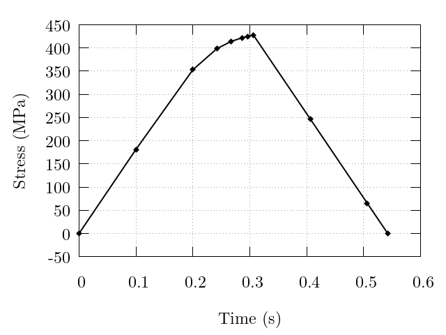

.. _overwriting:

Overwrting Polycrystal Attributes
---------------------------------

Certain simulation input may be supplied from external files in order to allow for a static configuration and mesh file to be used for multiple simulations while certain microstructure information is varied. This example covers the uniaxial loading and unloading (via load targeting) of a dual phase FCC/BCC polycrystal including in-grain orientation distributions. Two steps are defined with a standard time-step value of 0.1s and a minimum time-step value of 0.01s. Minimal boundary conditions are applied to the sample with the primary loading face set as :data:`x1` loaded in the :data:`+x` direction. Elemental orientations and grain/phase assignments are supplied from the external files :file:`simulation.ori` and :file:`simulation.phase`, respectively. Elemental equivalent deformation rate, work, orientations, surface-integrated forces, and nodal coordinates are output. Fiber-averaging processing is performed via Neper. Material parameters are those for the austenitic (:math:`\gamma`) and ferritic (:math:`\alpha`) phases of a LDX-2101 steel and were previously provided in :ref:`triaxial_clr_ex`. Illustrations of the results are provided below.

Phases are assigned to grains in :file:`simulation.phase` based on grain ID, resulting in a 50%/50% phase distribution, by:

::

    $Groups
    elset
    50
    1 1
    2 1
    ...
    26 2
    ...
    50 2
    $EndGroups

Orientations are assigned to individual elements in the mesh by:

::

    $ElementOrientations
    5455 rodrigues:active
    1 -0.251740631650 -0.214936324918 0.002481866070
    2 -0.263893837934 -0.212836283407 0.021747296015
    ...
    5454 -0.062896691423 0.070800028157 0.312930553247
    5455 -0.055849086418 0.072826013322 0.294773397825
    $EndElementOrientations

Note that even though :data:`$ElsetOrientations` are also present in :file:`simulation.ori` as generated via Neper, the presence of :data:`$ElementOrientations` will always override any other orientations present in :file:`simulation.ori` or in the mesh file (:file:`simulation.msh`).

.. figure:: overwriting/5_eltorientations.png
    :width: 40%
    :align: center

    Undeformed sample colored by orientation. Per-element orientations are assigned to the sample allowing for the prescription of initial misorientation within grains. Per-element orientations are generated from a 3-variate normal distribution with an average misorientation angle (with respect to a grain's average orientation) of 5 degrees.

.. figure:: overwriting/5_all.png
    :width: 75%
    :align: center

    Deformed sample after the (left) first step and (right) second step are completed (deformation field is exaggerated 50x for illustrative purposes). The left figure is colored by equivalent deformation rate and the right figure is colored by work.

    Evolution of the macroscopic normal stress. Note the increased point densities near to the load direction change exhibiting the simulation time-step value decreasing to accurately reach the load targets.
