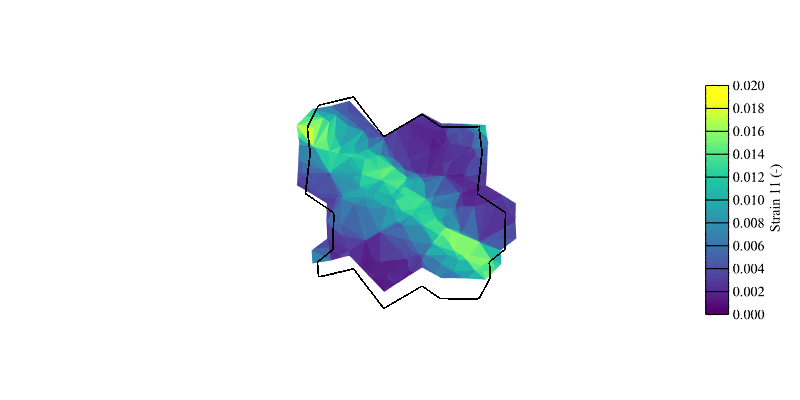

.. _periodic_rve_simulation:

Periodic RVE-type Simulation
============================

.. note:: Read first: :ref:`simple_simulation`

A periodic polycrystal containing 40 grains, generated and meshed by Neper, is used:

.. figure:: periodic_rve_simulation/mesh.png
   :align: center

The domain is a unit cube. Length units are assumed to be **mm**, thus, all pressure units assumed to be **MPa** for the simulation (including input parameters).
An FCC material with :ref:`aniso_elasticity` and the :ref:`base_model` for plasticity is considered, with the following material parameters:

.. list-table:: Single crystal elastic constants and plasticity parameters.
    :widths: 10 10 10 10 10 10 10 10
    :align: center
    :header-rows: 1

    * - :math:`C_{11}` [MPa]
      - :math:`C_{12}` [MPa]
      - :math:`C_{44}` [MPa]
      - :math:`m` [-]
      - :math:`\dot{\gamma_0}` [1/s]
      - :math:`h_0` [MPa]
      - :math:`g_0` [MPa]
      - :math:`g_s` [MPa]
    * - :math:`245.0 \times 10^3`
      - :math:`155.0 \times 10^3`
      - :math:`62.5 \times 10^3`
      - 0.05
      - 1.0
      - 200.0
      - 210.0
      - 330.0

As the domain is a periodic "(representative) volume element", the loading is defined in terms of *strain rate*, *target strain* and *maximal strain increment*.  Minimal changes (compared to :ref:`simple_simulation` and :ref:`periodic_rve_simulation`) is made to the :ref:`config_file` file, as described (and highlighted) below.   However, in the current implementation, all components of the strain rate must be specified.  Rigid-body motions are fixed automatically.

The example below shows plane tension-compression of the polycrystal.

  - :download:`simulation.msh <periodic_rve_simulation/simulation.msh>`
  - :download:`simulation.cfg <periodic_rve_simulation/simulation.cfg>`

    .. literalinclude:: periodic_rve_simulation/simulation.cfg
      :emphasize-lines: 26-31

.. figure:: periodic_rve_simulation/pbc_strain11.png
   :align: center

   Slove :math:`y`-view of the strain field (:math:`\epsilon_{11}`) at 1% strain (displacement field is exaggerated 10x for illustrative purposes). The lattice structure represents the underformed state.

   View of the strain field (:math:`\epsilon_{11}`) in the slice :math:`y=0.5` at 1% strain (displacement field is exaggerated 10x for illustrative purposes). The lattice structure represents the underformed state.
