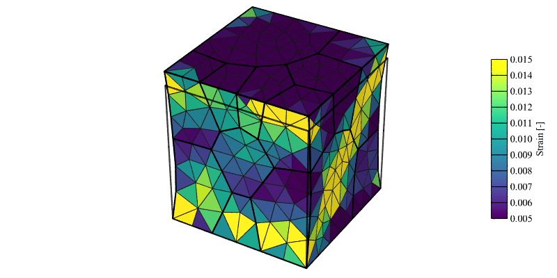
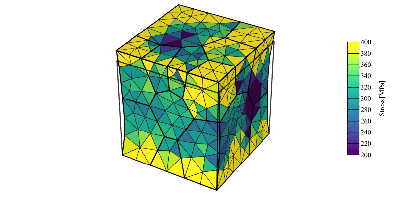

.. _simple_rve_simulation:

Simple RVE-type Simulation
==========================

.. note:: Read first: :ref:`simple_simulation`

A polycrystal containing 20 grains, generated and meshed by Neper, is used:

.. figure:: simple_simulation/mesh.png
   :align: center

The domain is a unit cube. Length units are assumed to be **mm**, thus, all pressure units assumed to be **MPa** for the simulation (including input parameters).
An FCC material with :ref:`aniso_elasticity` and the :ref:`base_model` for plasticity is considered, with the following material parameters:

.. list-table:: Single crystal elastic constants and plasticity parameters.
    :widths: 10 10 10 10 10 10 10 10
    :align: center
    :header-rows: 1

    * - :math:`C_{11}` [MPa]
      - :math:`C_{12}` [MPa]
      - :math:`C_{44}` [MPa]
      - :math:`m` [-]
      - :math:`\dot{\gamma_0}` [1/s]
      - :math:`h_0` [MPa]
      - :math:`g_0` [MPa]
      - :math:`g_s` [MPa]
    * - :math:`245.0 \times 10^3`
      - :math:`155.0 \times 10^3`
      - :math:`62.5 \times 10^3`
      - 0.05
      - 1.0
      - 200.0
      - 210.0
      - 330.0

As the domain is a cubic "(representative) volume element", and if the aim is to apply uniform loading, it makes particular sense to define the loading in terms of *strain rate*, *target strain* and *maximal strain increment* instead of the standard *velocity*, *target time* and *maximal time increment*.  The simulation described in :ref:`simple_simulation`, can then be run using a simplified :ref:`config_file` file, as described (and highlighted) below.

Specifying a Strain Rate (:data:`set_bc strainrate`), etc.
----------------------------------------------------------

  - :download:`simulation.msh <simple_rve_simulation/simulation.msh>`
  - :download:`simulation.cfg <simple_rve_simulation/simulation.cfg>`

    .. literalinclude:: simple_rve_simulation/simulation.cfg
      :emphasize-lines: 25,32-33

.. note:: As the :data:`set_bc strainrate` condition only act on the :math:`v_z` components, additional :data:`set_bc vel` conditions are still required to fix rigid-body motions.

Execution and simulation results are the same as in :ref:`simple_simulation`.
The deformed mesh is reproduced for completeness:

.. figure:: simple_simulation/strain_field.png
   :align: center

   Strain field (:math:`\epsilon_{33}`) at 1% axial strain (displacement field is exaggerated 10x for illustrative purposes).

.. figure:: simple_simulation/stress_field.png
   :align: center

   Stress field (:math:`\sigma_{33}`) at 1% axial strain (displacement field is exaggerated 10x for illustrative purposes).

Grip Boundary Conditions (:data:`grip`)
---------------------------------------

Grip boundary conditions, which can be activated using the :data:`grip` statement, are different in the sense that they fully constrain the reference and loading faces by prescribing zero velocities in the directions different from the loading direction.  Different strain and stress field result, especially close to the reference and loading faces.

  - :download:`simulation.msh <simple_rve_simulation/simulation.msh>`
  - :download:`simulation.cfg <simple_rve_simulation/simulation.cfg-grip>`

    .. literalinclude:: simple_rve_simulation/simulation.cfg-grip
      :emphasize-lines: 25

   Strain field (:math:`\epsilon_{33}`) at 1% axial strain (displacement field is exaggerated 10x for illustrative purposes).

   Stress field (:math:`\sigma_{33}`) at 1% axial strain (displacement field is exaggerated 10x for illustrative purposes).
