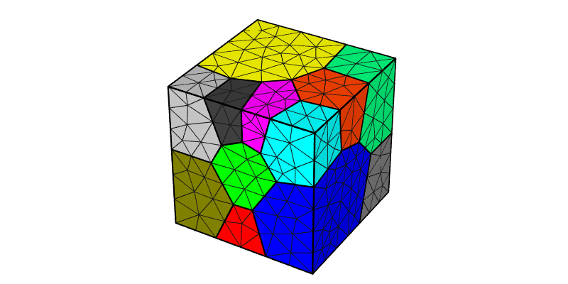
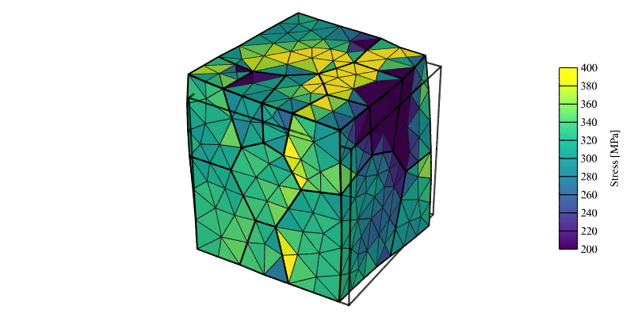
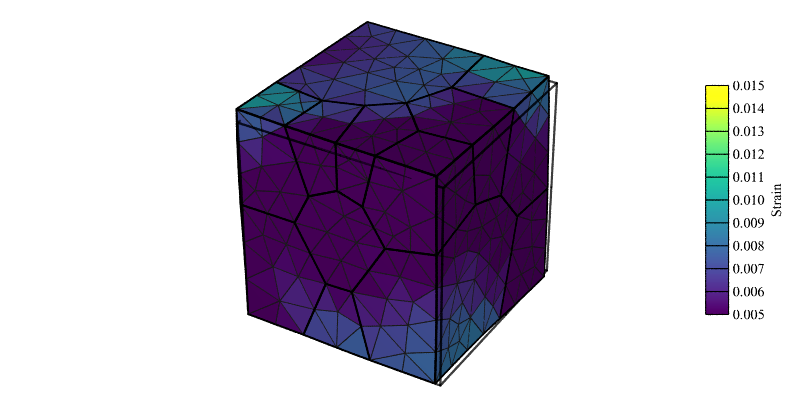
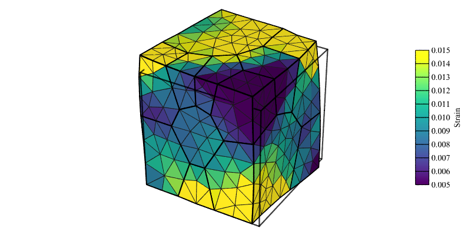
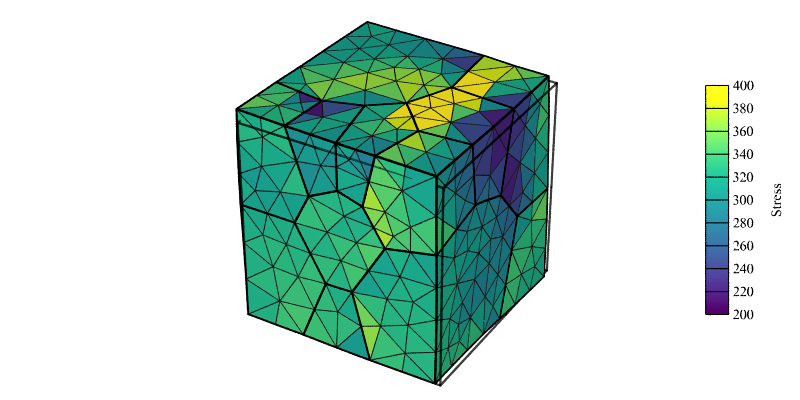

.. _simple_simulation:

Simple Simulation
=================

.. note:: Read also: :ref:`simple_rve_simulation`

A polycrystal containing 20 grains, generated and meshed by Neper, is used:

The domain is a unit cube. Length units are assumed to be **mm**, thus, all pressure units assumed to be **MPa** for the simulation (including input parameters).
An FCC material with :ref:`aniso_elasticity` and the :ref:`base_model` for plasticity is considered, with the following material parameters:

.. list-table:: Single crystal elastic constants and plasticity parameters.
    :widths: 10 10 10 10 10 10 10 10
    :align: center
    :header-rows: 1

    * - :math:`C_{11}` [MPa]
      - :math:`C_{12}` [MPa]
      - :math:`C_{44}` [MPa]
      - :math:`m` [-]
      - :math:`\dot{\gamma_0}` [1/s]
      - :math:`h_0` [MPa]
      - :math:`g_0` [MPa]
      - :math:`g_s` [MPa]
    * - :math:`245.0 \times 10^3`
      - :math:`155.0 \times 10^3`
      - :math:`62.5 \times 10^3`
      - 0.05
      - 1.0
      - 200.0
      - 210.0
      - 330.0

The polycrystal is deformed in tension along the :math:`z` direction up to 1\% strain, at a rate of 0.001 :math:`\text{s}^{-1}`, using simple velocity conditions (:math:`v_z=0` on :data:`z0` and :math:`v_z=0.001` on :data:`z1`, with additional constraints to avoid rigid-body motions).  The stress-strain information, and the the nodal coordinates, the elemental orientations, stresses and strains, and the surface forces at final time (:math:`t = 10\text{ s}`) are written to file.

Input Files
-----------

  - :download:`simulation.msh <simple_simulation/simulation.msh>`
  - :download:`simulation.cfg <simple_simulation/simulation.cfg>`

    .. literalinclude:: simple_simulation/simulation.cfg

Execution
---------

In the simulation directory (:file:`simple_simulation`):

  .. code-block:: console

   $ mpirun -np 4 fepx

    ==========================     F   E   P   X   ==========================
    Info   : A finite element software package for  polycrystal plasticity.
    Info   : Version 2.0.0
    Info   : Running on 4 cores.
    Info   : <https://fepx.info>
    Info   : Copyright (C) 1996-2023, DPLab, ACME Lab, CNRS.
    Info   : ---------------------------------------------------------------
    Info   : Start time: 2023-12-1 at 14:03
    Info   : Loading simulation...
    Info   :   [i] Parsing file `simulation.cfg'...
    Info   :   - Material parameters:
    Info   :     > Number of phases: 1
    Info   :     > phase 1 - crystal type:   fcc
    Info   :     > m:               0.500000E-01
    Info   :     > gammadot_0:      0.100000E+01
    Info   :     > h_0:             0.200000E+03
    Info   :     > g_0:             0.210000E+03
    Info   :     > g_s0:            0.330000E+03
    Info   :     > n:              -0.100000E+01
    Info   :     > c11:             0.245000E+06
    Info   :     > c12:             0.155000E+06
    Info   :     > c44:             0.625000E+05
    Info   :   [i] Parsed file `simulation.cfg'.
    Info   :   [i] Parsing file `simulation.msh'...
    Info   :   - Mesh parameters:
    Info   :     > Node number: 4008
    Info   :     > Elt  number: 2453
    Info   :   [i] Parsed file `simulation.msh'.
    Info   : Initializing simulation...
    Info   :   - Initializing fields from isotropic viscoplastic solution
    Info   :     > solveit_vp: Iteration 1
    Info   :       . Solving NL iteration... R = 0.4267E-01 (490 iters)
    Info   :     > solveit_vp: Iteration 2
    Info   :       . Solving NL iteration... R = 0.1751E-01 (489 iters)
    Info   :     > solveit_vp: Iteration 3
    Info   :       . Solving NL iteration... R = 0.1167E-01 (489 iters)
    Info   :     > Converged in 3 iterations
    Info   : Running step 1...
    Info   :   - Increment 1: t = 1.0000 secs, dt = 1.0000 secs
    Info   :     > solveit_evp: Iteration 1
    Info   :       . Solving SA iteration... R = 0.4928E+00 (622 iters)
    Info   :     > solveit_evp: Iteration 2
    Info   :       . Solving SA iteration... R = 0.2405E-03 (625 iters)
    Info   :     > Converged in 2 iterations

    [...]

    Info   : Elapsed time:    25.044 secs.
    Info   : Final step terminated. Simulation completed successfully.
    ========================================================================

The content of the resulting :ref:`simulation_directory`, :file:`simple_simulation.sim`, is::

  simple_simulation.sim
  ├── inputs
  │   ├── simulation.cfg
  │   └── simulation.msh
  └── results
    ├── elts
    │   ├── ori
    │   │   ├── ori.step0
    │   │   └── ori.step1
    │   ├── strain
    │   │   ├── strain.step0
    │   │   └── strain.step1
    │   ├── stress
    │   │   ├── stress.step0
    │   │   └── stress.step1
    └── nodes
        └── coo
            ├── coo.step0
            └── coo.step1

Simulation Results
------------------

The stress-strain curve can be plotted from the :file:`post.force.z1` file:

  .. code-block :: console

    $ gnuplot plot_stress_strain.gp

.. figure:: simple_simulation/stress_strain.png
   :align: center

   Macroscopic stress-strain curve recovered from the surface-integrated forces in post.force.z1. Markers denote values output at each increment.

The results can be plotted using Neper:

  .. code-block :: console

    $ neper -V simple_simulation.sim -step 1 -showtess 1 -showcell 0 -showedge "domtype==1" -dataedgerad 0.005 -dataedgetrs 0.5 -datanodecoofact 10 -showelt1d all -dataelt1drad 0.005 -dataelt3dedgerad 0.0025 -dataelt3dedgecol 32:32:32 -imagesize 800:400 -datanodecoo coo -dataeltcol strain33 -dataeltscale 0.005:0.015 -dataeltscaletitle "Strain [-]" -print strain -dataeltcol stress33 -dataeltscale 200:400 -dataeltscaletitle "Stress [MPa]" -print stress
    $ convert strain.png strain-scale3d.png -gravity East -composite deformed_mesh_strain.png
    $ convert stress.png stress-scale3d.png -gravity East -composite deformed_mesh_stress.png

.. figure:: simple_simulation/strain_field.png
   :align: center

   Strain field (:math:`\epsilon_{33}`) at 1% axial strain (displacement field is exaggerated 10x for illustrative purposes).

   Stress field (:math:`\sigma_{33}`) at 1% axial strain (displacement field is exaggerated 10x for illustrative purposes).

Printing Intermediary Results
-----------------------------

While the :data:`forces` output is written at all *increments*, nodal and elemental results are only written at the end of *steps*.  To get intermediary results, it is therefore necessary to declare several *steps*.  This can be done with the changes highlighted below.

  - :download:`simulation.msh <simple_simulation/simulation.msh>`
  - :download:`simulation.cfg <simple_simulation/simulation.cfg-steps>`

    .. literalinclude:: simple_simulation/simulation.cfg-steps
      :emphasize-lines: 32-33

The content of the resulting :ref:`simulation_directory`, :file:`simple_simulation.sim`, is::

  simple_simulation.sim
  ├── inputs
  │   ├── simulation.cfg
  │   └── simulation.msh
  └── results
    ├── elts
    │   ├── ori
    │   │   ├── ori.step0
    │   │   ├── ori.step1
    │   │   └── ori.step2
    │   ├── strain
    │   │   ├── strain.step0
    │   │   ├── strain.step1
    │   │   └── strain.step2
    │   └── stress
    │       ├── stress.step0
    │       ├── stress.step1
    │       └── stress.step2
    └── nodes
        └── coo
            ├── coo.step0
            ├── coo.step1
            └── coo.step2

The deformed mesh can be plotted using Neper:

  .. code-block :: console

    $ neper -V simple_simulation.sim -step 1 -showtess 1 -showcell 0 -showedge "domtype==1" -dataedgerad 0.005 -dataedgetrs 0.5 -datanodecoofact 10 -showelt1d all -dataelt1drad 0.005 -dataelt3dedgerad 0.0025 -dataelt3dedgecol 32:32:32 -imagesize 800:400 -loop STEP 1 1 2 -step STEP -datanodecoo coo -dataeltcol strain33 -dataeltscale 0.005:0.015 -dataeltscaletitle "Strain [-]" -print strainSTEP -dataeltcol stress33 -dataeltscale 200:400 -dataeltscaletitle "Stress [MPa]" -print stressSTEP -endloop
    $ convert strain1.png strain1-scale3d.png -gravity East -composite deformed_mesh_strain1.png
    $ convert strain2.png strain2-scale3d.png -gravity East -composite deformed_mesh_strain2.png
    $ convert stress1.png stress1-scale3d.png -gravity East -composite deformed_mesh_stress1.png
    $ convert stress2.png stress2-scale3d.png -gravity East -composite deformed_mesh_stress2.png

   Strain field (:math:`\epsilon_{33}`) at 0.5% axial strain (displacement field is exaggerated 10x for illustrative purposes).

   Strain field (:math:`\epsilon_{33}`) at 1% axial strain (displacement field is exaggerated 10x for illustrative purposes).

   Stress field (:math:`\sigma_{33}`) at 0.5% axial strain (displacement field is exaggerated 10x for illustrative purposes).

   Stress field (:math:`\sigma_{33}`) at 1% axial strain (displacement field is exaggerated 10x for illustrative purposes).

