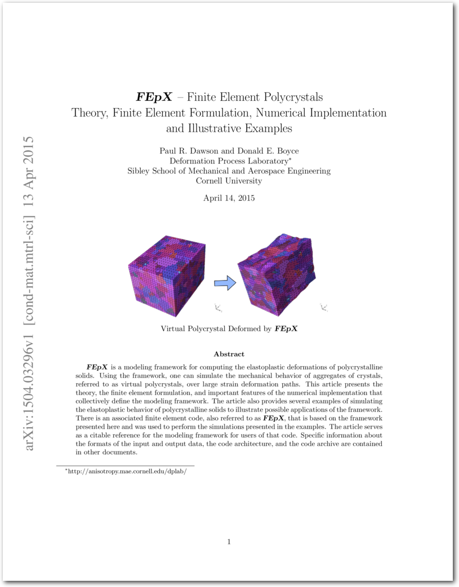

.. _papers:

Reference Papers
================

A brief overview of the base models employed in FEPX, as well as the general Neper/FEPX workflow are documented in this paper (click the image to access the article):

.. figure:: imgs/paper-neperfepx-riso2022.png
   :width: 50%
   :align: center
   :target: https://doi.org/10.1088/1757-899X/1249/1/012021

   R Quey and M Kasemer, *The Neper/FEPX project:  free / open-source polycrystal generation, deformation simulation, and post-processing*, **IOP Conference Series Materials Science and Engineering**, vol. 1249, pp. 012021, 2022.

The methods implemented in FEPX are documented in this theory paper:

   PR Dawson and DE Boyce, *FEpX – Finite Element Polycrystals: Theory, finite element formulation, numerical implementation and illustrative examples*, **arXiv:1504.03296 [cond-mat.mtrl-sci]**, 2015.
